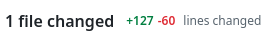
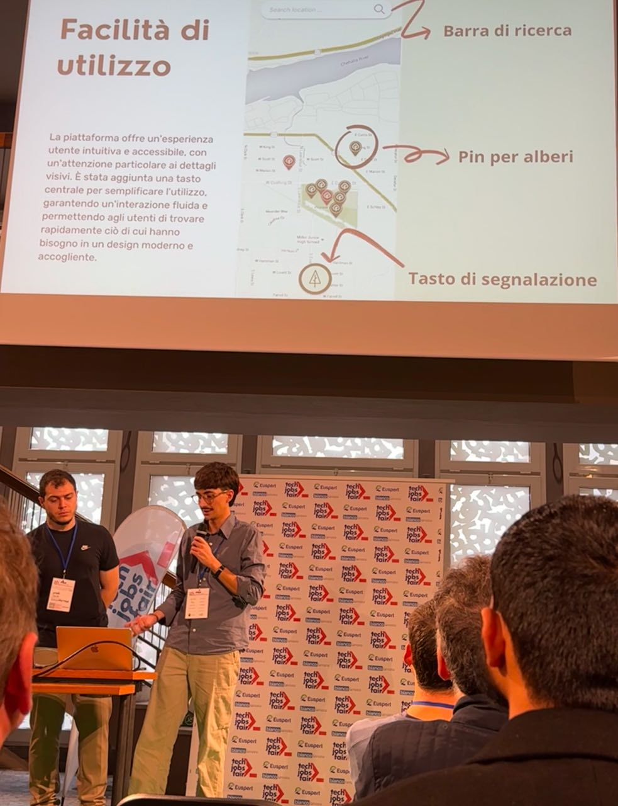

## Would you partipate in an Hackaton with no prizes?

I would, i mean i did, and it was **awesome**! 
Maybe because it was my fist hackaton ever or because it was an intresting hacking week. 
Let me recap really quick how it worked:
  1. One week  ⏰
  2. 8 strangers to remote work with 👥
  3. build an app from scratch 🚀

## Kickoff 🎉

The hackathon kicked off on my **birthday** 🎂, and since I had a weekend trip planned, I couldn’t contribute much right away. I made sure my teammates knew in advance though. 
After the project was unveiled and the team were formed, we instantly started mingling and sharing our skill and value that we could offer during the week ahead.

After that, we split in 3 teams:
- 👨‍💻 Frontend ⬅️ I was here!!
- 🔧 Backend ( next time i want to be here though )
- 📜 Docs and Support

I instantly fell in love with my team, they were so skilled and open to share knowledge and insight, that i will for sure keep in touch with them 
> We are organizing to go to the next Codemotion conference together :D

When I came back from my weekend, I started catching up with all the amazing work that they've done while I was away. It was **A LOT** to catch up on, but somehow i managed.

So I was ready to bring my contribution to the project, so after meetings and chat ( on Telegram ) I started writing code, making **PR** and **merging** into **main**.

One of my favorite parts was when everyone had their tasks, and then, after merging our work together, we saw the app make real progress.
Well to be honest merging was not so easy at fist beacuse we were using different `Priettier` config and that made the PR reviews veeery difficult to read and review.

i changed one line... i thought. 🙄

Finally, a teammate setted up a Prettier config we could use project-wide, and that gave us a huge boost on the project.

I hadn’t realized Prettier could cause such problems when working in a slightly larger group than I was used to. Lesson learned! 😅

Suddenly, some people drop off of the hackaton, so in the last day we had to made the presentation and prepare the speech for the in person event, where we got the chance to show our working demo.

This is me (with the mic🎤) the day of the event with Omar.

Since we ( the team ) all had something else going on —work, university, or personal projects— I am so proud of our team's work and i think it was the most beatiful and intuitive app. Even though the other projects where great in other ways, so shout out to them as well.👏

### So, No Prize, Huh?
yeah it was a bummer but i **gained so much knowledge**, **meet new awesome fellows** and be able to **present in fornt of an audience** — which, to me, was the real prize. (Yes, it’s super cheesy, but I swear, it’s true! 🥲).

In the end,  I’d totally do another hackathon in the future, and meanwhile, i can check it off my 2024 bucketlist. ✅  
You can check the project and the demo on my [Github](https://github.com/DavideBri/Botanica).

I really want to know your first hackaton story, so feel free to reach out on mastodon or just leave a comment below! 👇👇
