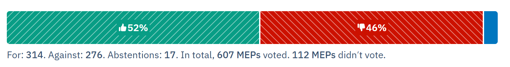

On **9 July 2026** the European Parliament let *"Chat Control 1.0"* through: suspicionless mass scanning of private messages. Same thing the Parliament had already rejected **twice** back in March.

Plot twist that still cracks me up: most MEPs who voted were actually against it.

https://howtheyvote.eu/votes/195775

But killing it needed an absolute majority of **361 votes**, and we didn't hit the number. So a rule the majority in the room voted *no* on is now live until 2028, thanks to voting math and a cheeky fast-track right before summer break. Cool cool cool.

## I did my part

Not an MEP, just a guy who cares. In the earlier rounds I did the noisy-citizen thing: posted about it online, explained it to friends IRL, tried to get people to see that "just scanning messages to catch bad guys" is nowhere near as harmless as it sounds.

I emailed the Italian MEPs too. Multiple times.

**Reply rate: ~2%** (yes, 98% left me on read lol). Felt like yelling into the void for a while.

But I wasn't yelling alone. A ton of other people kept posting and refusing to shut up, and together we got loud enough to reach some very busy ears. That "majority voted against" result didn't happen by accident.

## Italy showed up! 🤌🍝

Small flex: from what I saw, Italy was the one country where a clear majority of our MEPs voted against it. Was genuinely proud of that. We pulled up.

It just wasn't enough this round. But heads up: this was only the *interim* version. The real fight over the permanent one ("Chat Control 2.0") kicks off again **in September**, and after this week, pushing a permanent version through is gonna be rough for them.

## What to actually do from today

Quick practical bit. Assume anything you send on a platform that is **not end-to-end encrypted** can get scanned.

That's DMs on Instagram, Discord, Snapchat, Skype, Xbox, plus normal email like Gmail and iCloud. Keep the sensitive stuff off them:

| Don't send this via non-E2E apps | Send it here instead |
|---|---|
| Photo of your ID or a document | Signal, in person, or a proper secure-share tool |
| Health info, diagnosis, therapy stuff | Signal, Mail but within password protected .zip |
| Passwords, bank details, home address | A password manager, never a chat box |

Simple rule: **if the platform *could* read it, assume something eventually will.** WhatsApp is E2E by default and out of scope here, Signal is my go-to for anything that actually matters.

## Where I'm actually hyped

Here's the funny part. Only *now* that it's actually passed, I'm suddenly seeing way more media coverage about it. Regular news, not just the usual privacy-nerd corners of the internet. And I'm seeing non-techy people, people who never cared about this stuff before, actually starting to take it seriously. Nothing like a law finally landing to make people go "wait, what?" LOL.

And honestly that's exactly why I see a real future for tech like **peer-to-peer**, not as a buzzword but as an architecture. No central server holding everyone's messages means no chokepoint for anyone to scan. Privacy stops being a promise a vote can delete and becomes something baked into how the app is built.

That's why I'm all in on stuff like **[Pears](https://pears.com/)** (Pear Runtime, by the Holepunch team, backed by Tether). Open-source runtime for fully P2P apps, zero traditional servers, your app just runs directly between the people using it. Their chat app *Keet* calls itself "the chat app that knows nothing," because there's literally no server that *could* know. There's already a P2P password manager (PearPass), P2P tunnels, local-first AI, all on the same idea.

Now stack that on the other big shift: shipping software isn't gatekept anymore. With modern tooling, yeah, AI-assisted self-built software included, basically anyone with a laptop and an idea can build their own app that actually respects them. More awareness meets more people who can just *build the thing* instead of waiting for a platform to grant them privacy. That combo, P2P plus everybody being able to ship their own software, is what's taking control of our data back into our own hands.

So no, a bad vote isn't making me log off. If anything it makes the mission obvious. Rules that treat every citizen as a suspect are the best possible argument for infrastructure that literally *can't* comply, because there's nothing in the middle to hand over.

**We lost a vote, not the direction.** Full data ownership and real digital sovereignty, that's where we're going, and this time we get to build it ourselves.

Onward. See you in September. 🏴‍☠️

### Sources
* [Patrick Breyer website (MEP)](https://www.patrick-breyer.de/en/eu-parliament-greenlights-chat-control-1-0-breyer-our-children-lose-out/)

* [Fight Chat Control movement](https://fightchatcontrol.eu/)

#### Little bonus if you arrived all the way down here:
