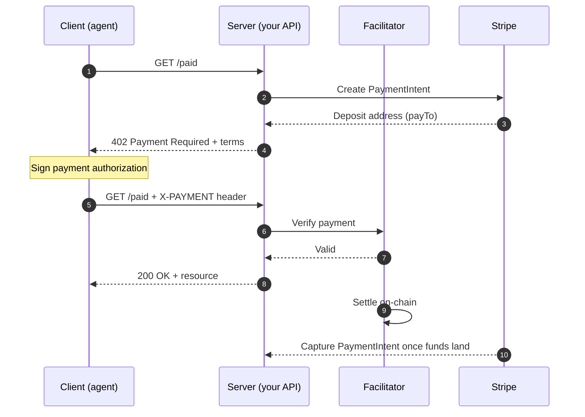

There's a status code in the HTTP spec that almost no backend engineer has ever returned on purpose: `402 Payment Required`. It's been sitting in the standard since the early 90s, marked *"reserved for future use,"* politely ignored by every API any of us has ever shipped.

In 2026 it became one of the more interesting things in crypto.

The protocol reviving it is called **x402**, and it's worth understanding even if you never touch a blockchain. The mechanics are pure backend, and the story around it is a clean lesson in telling real infrastructure apart from a good narrative.

---

## What x402 actually does

Strip away the crypto framing and it's a payment handshake bolted onto normal HTTP:

- **Client** asks for a paid resource, say a premium data endpoint
- **Server** answers `402` with the terms: which chain, which token, how much, which wallet
- **Client** signs a payment payload, attaches it to the request header, and retries
- A **facilitator** verifies the signature and settles on-chain
- **Server** returns the resource, plus a receipt

Under the hood it leans on `EIP-3009` and `Permit2`, so the money moves in seconds for a fraction of a cent on a Layer 2.

On the wire, it's barely more than this:

```http
# 1. Client asks. Server says "pay first" and lists its terms.
GET /v1/market-data

HTTP/1.1 402 Payment Required
{
  "accepts": [{
    "scheme": "exact",
    "network": "base",
    "asset": "USDC",
    "maxAmountRequired": "10000",   // 0.01 USDC, 6 decimals
    "payTo": "0xF1a2...9bC3"
  }]
}

# 2. Client signs the payment and retries with it in a header.
GET /v1/market-data
X-PAYMENT: eyJzY2hlbWUiOiJleGFjdCIsInNpZ25hdHVyZSI6...

HTTP/1.1 200 OK
X-PAYMENT-RESPONSE: eyJ0eEhhc2giOiIweGFi...   // settlement receipt
{ "price": 64213.5 }
```

No account. No API key. No card on file. No T+1 settlement through a processor.

> The request itself carries the payment.

If you've written middleware, you can see why that's elegant. It fits the shape of the web instead of fighting it.

---

## The full lifecycle

That raw exchange is the minimal version. In a real integration a **facilitator** verifies the signed payment and a payment processor settles it. Here's the full flow, modeled on [Stripe's machine-payments lifecycle](https://docs.stripe.com/payments/machine/x402#payment-lifecycle):



The agent gets its data in a single retry, while settlement and capture finish in the background. From the server's side, it's a middleware and a header check.

---

## Why anyone bothered

The whole thing exists because of [**AI agents**](https://crypto.news/what-are-ai-agents-in-crypto-agentic-payments-and-x402-explained/).

A card and a chargeback window are built for a human clicking "buy." They fall apart when an autonomous agent wants to pay a tenth of a cent per API call, thousands of times an hour, with no human in the loop. **Stablecoins** settle machine to machine in seconds and hold a stable dollar value, so an agent can budget in USD and pay per request without touching card rails.

That's the pitch, and the names behind it aren't small. [Coinbase created x402](https://www.crossmint.com/learn/agentic-payments-protocols-compared). The foundation governing it now sits under the Linux Foundation, backed by Google, Cloudflare, Stripe, Circle, Visa, Mastercard, and AWS. Amazon shipped [native support inside Bedrock AgentCore](https://aws.amazon.com/blogs/industries/x402-and-agentic-commerce-redefining-autonomous-payments-in-financial-services/). It rarely stands alone either: Google's **AP2** handles the authorization layer, proving the user actually allowed the agent to spend, while x402 handles settlement. Different jobs, same stack.

---

## The part most posts skip

The headline numbers deserve a second look. [Chainalysis](https://www.chainalysis.com/blog/x402-agentic-payments-adoption/) clocked over **100 million** x402 transactions on Base, but a large chunk came from **PING**, a pay-to-mint memecoin that turned the protocol into a game: hit a URL, get a `402`, pay 1 USDC, mint, repeat. Strip that out and [adjusted volume actually fell ~77%](https://letsdatascience.com/news/x402-reveals-approval-gap-in-agentic-micropayments-761bf8e7) from its late-2025 peak, with a period [reported as $24 million landing closer to $1.6 million](https://www.startuphub.ai/ai-news/startup-news/2026/x402-payments-the-real-numbers) once wash trades were removed.

==The infrastructure is real. The demand is mostly still a bet on the future.==

---

## Why it still matters

Still, it's the most interesting primitive I've seen come out of crypto in a while, precisely because it's barely about crypto. Per-request pricing, native to the protocol, a signed receipt on every call, no signup. If you run an API, it's worth experimenting with regardless of whether the agent economy arrives on schedule.

Just don't mistake infrastructure readiness for [product-market fit](https://www.coindesk.com/markets/2026/03/11/coinbase-backed-ai-payments-protocol-wants-to-fix-micropayment-but-demand-is-just-not-there-yet). Google and AWS aren't building on today's $1.6 million of real volume. They're building on what they think agents become.

---

So `402` finally has a job.

Whether it's a career or a gig is still up to the agents.