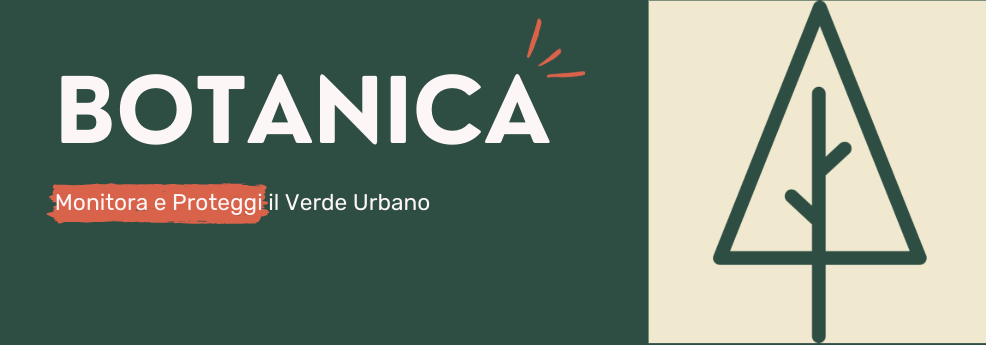
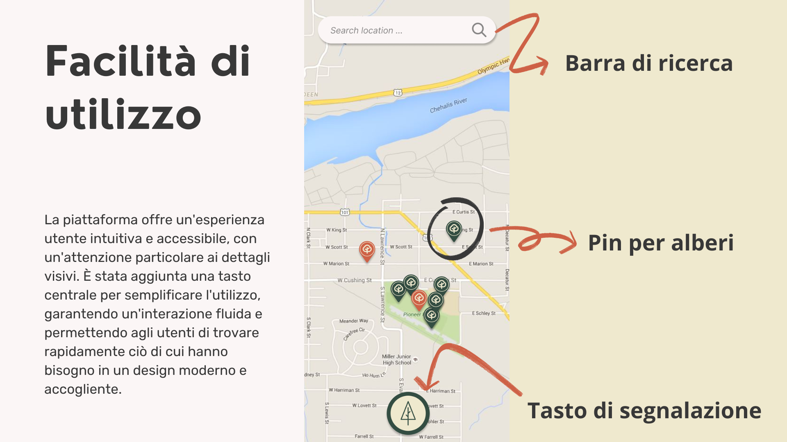

Botanica, è stato un progetto sviluppato per l'hackaton organizzato da Tech Jobs Fair.

L'obiettivo del progetto era sviluppare un'applicazione web e mobile che permetta agli utenti di visualizzare una mappa interattiva delle aree verdi e degli alberi di una città e di inviare segnalazioni relative a problemi come rami rotti, piante malate o altre condizioni pericolose. L'applicazione deve offrire una gestione intuitiva delle segnalazioni, garantendo una facile consultazione per i tecnici addetti alla manutenzione del verde urbano.

Il nostro progetto è stato poi presentato a Pisa insieme agli altri partecipanti.

